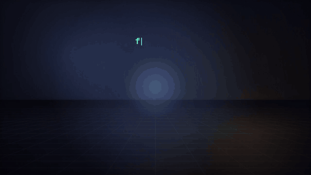

# Canvas Motion

**一支 HTML，就是一支影片。**

Canvas Motion 是一個開放式的 [Claude Skill](https://docs.claude.com/en/docs/agents-and-tools/agent-skills/overview)，讓 Claude 用程式做出動畫短片：畫面由 Canvas 逐格繪製，配樂由 WebAudio 即時合成，整支片就是一個 HTML 檔。主題、敘事結構、畫面與視覺風格都不設限：Claude 會依你的內容與情境設計分鏡，並提出適合的風格建議。同一個檔案可以直接在瀏覽器播放、發布成 claude.ai Artifact 分享連結，也能匯出成含配樂的 MP4 或 GIF。



這支介紹動畫本身就是用 Canvas Motion 做的，分鏡與場景原始檔在 [`docs/intro/`](docs/intro/)。

## 特色

- **創意優先，不套框架**：沒有版面零件、沒有敘事範本。每一幕的構圖、隱喻與動畫都由 Claude 依素材自己發想、寫成場景程式，數字、流程、據點也會變成畫面裡的物件在做事，而不是排成卡片。
- **自由敘事**：依素材設計結構，幕數、順序與每一幕的畫面都不受限。
- **現成畫筆**：文件、人物、筆電、齒輪、燈泡、星星、弧線等常用物件（`library/kit.js`），加上 10 種畫風的形狀與渲染，只為省時間，不是可選清單。
- **多種畫風、構圖開放**：動畫風背景、水彩、水墨、扁平插畫、像素、霓虹、低多邊形、剪紙、美漫網點、蠟筆，Claude 依情境建議畫風；畫面要放什麼、怎麼安排，由你描述。
- **依情境建議風格**：Claude 會依主題、觀眾與播放場合提出視覺與配樂風格的建議，也能配合品牌色客製。
- **橫式、直式都有專屬版面**：同一支片在電腦上是 16:9，在手機上自動變成 9:16，不是等比縮小。
- **畫面跟著音樂走**：場景切點對齊小節，配樂依每幕的強度（energy）自動編曲，結尾自動收成和弦。
- **配樂也能自己寫**：參數調不出的曲風（戲曲、民族樂、特定樂器）可以整支自己作曲，引擎提供鑼、鈸、梆子、皮鼓、滑音弦等合成樂器，鑼鼓點也能對準角色動作的拍點。
- **好看靠手藝**：動作函式庫（彈簧、預備動作、擠壓伸展、抹影、鏡頭、視差）、每幕必填的高光瞬間與延續、音效綁動作、高潮前靜默、匯出動態模糊；`taste.py` 會量出「畫面沒在動、沒對拍、高潮沒演出來、像投影片」。
- **會演戲的角色**：程序化角色骨架（走路、跑步、武術姿勢、9 種表情、自動眨眼），扁平插畫風畫法最適合當主角，也有動漫、美漫、港漫畫法；角色設定表 `castsheet.py`。
- **類型特效**：美漫（網點、爆炸框）、港漫（氣勁、集中線、斜格）、日式動畫（衝擊幀、流線）、電影（寬銀幕、青橙調色、光束），新增 hkcomic、amcomic、cinema 三種風格。
- **劇組流程做一分鐘故事片**：編劇（一句話故事、主角弧線、三幕節拍）、美術、導演（景別、運鏡、畫面方向）、剪輯、聲音、場記，storyboard 會檢查三幕比例、節拍、景別變化、跳軸與剪輯節奏。
- **所見即所得**：每一格都是 `frame(t)` 的純函式，所以播放、截圖驗證、匯出 MP4 的畫面完全一致。
- **穩定出片**：分鏡節奏檢查、風格自動驗證（對比不足自動修正）、場景程式檢查、文字裁切／重疊偵測、數字出處追溯，出錯時 Claude 會自己修到通過。

## 視覺風格

風格不從固定清單裡挑選。Claude 會依內容的情境（主題、觀眾、播放場合、想留下的感受）提出畫風與風格建議，說明配色、字體、轉場與配樂的方向與理由，你確認或調整後再製作。**構圖由你決定**：Claude 會用開放式問題問你畫面的主體、場景、遠近與動態，並附上一個依素材想到的構圖供你參考。有品牌規範時，也可以直接提供品牌色與字體。

## 安裝

### claude.ai

1. 到 [Releases](../../releases) 下載 `canvas-motion.skill`，或自己打包（見下方「開發」）。
2. 在 claude.ai 的「設定 → Capabilities → Skills」上傳。
3. 需要開啟「Code execution and file creation」。

### Claude Code

```bash
git clone https://github.com/chengwesley/canvas-motion.git
cp -r canvas-motion/canvas-motion ~/.claude/skills/
```

### 環境需求

| 工具 | 用途 | 缺少時 |
|---|---|---|
| Python 3.10+ | 建置、截圖、匯出腳本 | 必要 |
| Node.js | 建置時的語法檢查 | 可缺，會略過檢查 |
| Playwright + Chromium | 截圖驗證、MP4 匯出 | 可缺，但只能產出 HTML |
| ffmpeg | MP4 匯出 | 可用 `pip install imageio-ffmpeg` 代替 |
| Pillow | 縮圖總覽 | 截圖時必要 |
| 中文字型 | 截圖顯示中文 | 截圖會出現方框 |

執行 `python3 canvas-motion/scripts/check_env.py` 可以一次檢查。claude.ai 的程式執行環境已經全部內建。

## 使用方式

### 跟 Claude 說

安裝後直接用自然語言描述，Claude 會自己決定何時使用這個 skill：

> 幫我把這份產品說明做成 30 秒的介紹影片，要直式，給 IG Reels 用。

> 把這篇文章的核心概念做成一支動態解說，風格請你依內容建議。

> 用這些數字講一個故事，重點是最後那個轉折。

你只要說需求與情境。Claude 會從目的、觀眾與播放平台推斷片長、比例、敘事、畫風與風格，**一次給你一份提案**（規格、構圖、畫風、風格方向、分鏡表），你確認後就直接做到完成，並自動檢查版面、文字與素材出處。說「直接做」或短片 15 秒內時會跳過確認，直接採用建議的構圖，交付時說明。**畫面上的文案和數字只會來自你提供的素材**；素材撐不起某一幕時，Claude 會刪掉那一幕，而不是自行編造內容。

### 手動操作

```bash
SKILL=canvas-motion

# 1. 寫分鏡 storyboard.json（格式見 scripts/storyboard.py 開頭），先預覽分鏡表與節奏檢查
python3 $SKILL/scripts/storyboard.py storyboard.json --preview

# 2. 產生專案（project.json + 自訂場景鷹架）
python3 $SKILL/scripts/storyboard.py storyboard.json my-video

# 3. 需要自訂畫面時，在 my-video/scenes/ 編輯場景函式（寫法見 references/api.md）

# 4. 一鍵檢查（建置＋縮圖＋文字檢查），結束碼 0 才算通過
python3 $SKILL/scripts/verify.py my-video                # → my-video/dist/index.html、my-video/sheets/*.jpg

# 5. 匯出 MP4 或 GIF
python3 $SKILL/scripts/export.py my-video out.mp4 --size 1080x1920 --mobile --verify 2,10
python3 $SKILL/scripts/export.py my-video out.gif
```

`dist/index.html` 用任何瀏覽器打開就能播放；空白鍵暫停，左右鍵前後跳一小節，右下角可以切換比例。

### project.json 範例

```json
{
  "title": "新功能發表",
  "style": { "base": "tech", "mood": "俐落、有未來感", "colors": { "a1": "#5ef2c6" }, "music": { "bpm": 116 } },
  "aspect": "auto",
  "scenes": [
    { "fn": "sHook",    "bars": 2, "energy": 0.35, "trans": "zoom" },
    { "fn": "sFeature", "bars": 3, "energy": 0.7,  "trans": "push" },
    { "fn": "sOutro",   "bars": 2, "energy": 1 }
  ]
}
```

- `fn`：這幕的場景函式，寫在 `scenes/` 裡。
- `style`：風格參數，由 Claude 依情境決定；建置時會自動驗證對比、字體與節奏並修正（格式見 [`styles/_schema.json`](canvas-motion/styles/_schema.json)）。
- `bars`：這幕佔幾小節（120 BPM 時一小節 2 秒）。
- `energy`：0–1，控制配樂密度，由低到高安排情緒起伏。
- `trans`：離開這幕的轉場，可用 `cut` `fade` `push` `wipe` `zoom` `iris` `flash` `glitch`。

場景函式的寫法見 [`references/api.md`](canvas-motion/references/api.md) 與 [`examples/keynote-demo`](canvas-motion/examples/keynote-demo)。

## 專案結構

```
.
├── README.md
├── docs/                      README 用的圖片
└── canvas-motion/             ← skill 本體（安裝的就是這個資料夾）
    ├── SKILL.md               給 Claude 的操作說明
    ├── engine/                固定引擎：HTML 外殼、繪圖與排版、時間軸與配樂、播放器
    ├── library/               繪圖小工具 kit.js、畫風 looks.js（畫筆，不是版面）
    ├── styles/                風格設定
    ├── scripts/               verify / storyboard / build / sheet / export / style_gen / check_env / selftest
    ├── references/            direction.md（情境→規格與節奏）、looks.md（畫風與常用形狀）、
    │                          api.md（場景寫法）、style-pack.md（風格設定）
    └── examples/              範例專案（也是回歸測試）
```

## 運作原理

```
project.json + scenes/*.js
        │  build.py
        ▼
engine/infra.js ─ 風格設定 ─ 場景 ─ engine/tail.js
        │
        ▼
dist/index.html（單一檔案，無外部依賴，字體從 Google Fonts 載入）
        │
        ├── 瀏覽器播放：requestAnimationFrame → frame(t)，AudioContext 即時排程配樂
        ├── sheet.py：Playwright 呼叫 frame(t) 截圖 → 縮圖總覽
        └── export.py：OfflineAudioContext 合成 WAV → 逐格 frame(i/fps) → ffmpeg（H.264 + AAC）
```

- **時間軸**：場景長度以小節計算，切點落在小節第一拍。轉場中點對齊切點，期間同時繪製前後兩幕再合成。
- **文字**：`txt()` 延後到後製之後才繪製，所以不會被 bloom 糊掉；中文換行支援避頭點。
- **配樂**：每 16 分音符呼叫一次 `step()`，依當下場景的 energy 決定要加入哪些聲部（pad、鼓、bass、主旋律），和弦進行與音色由風格設定決定。專案若在 `scenes/` 定義全域函式 `MUSIC(A, i, t, info)`，整支配樂改由它負責（樂器：`tone`、`bend`、`gong`、`cymbal`、`woodblock`、`drum`、`kick`、`pad`…）。
- **效能**：DPR 上限 1.5，背景與光暈預先烘焙成低解析度圖層，重複繪製的元素快取到 offscreen canvas。

## 已知限制

- 不處理實拍影片、照片素材或角色逐格動畫。
- 程式執行環境無法連上 Google Fonts，所以截圖使用系統的 Noto Sans CJK；線上播放時才會用風格設定指定的字體，兩者字型會略有不同。
- 在沒有 GPU 的環境（例如雲端容器）中繪製較慢，但只影響截圖與匯出的速度，不影響成品品質。
- 瀏覽器規定必須由使用者點擊後才能播放聲音，所以頁面一定會先顯示播放鈕。

## 開發

修改後跑回歸測試（建置所有組合，並對範例專案做截圖與文字檢查）：

```bash
cd canvas-motion
python3 scripts/selftest.py --sheet
```

確認沒有場景錯誤，並逐格檢查縮圖。

打包成 `.skill` 檔（就是 zip，最上層是 `canvas-motion/` 資料夾）：

```bash
zip -r canvas-motion.skill canvas-motion -x "*/dist/*" "*/sheets/*" "*/__pycache__/*"
```

風格設定的格式見 [`references/style-pack.md`](canvas-motion/references/style-pack.md)；場景寫法見 [`references/api.md`](canvas-motion/references/api.md)。
